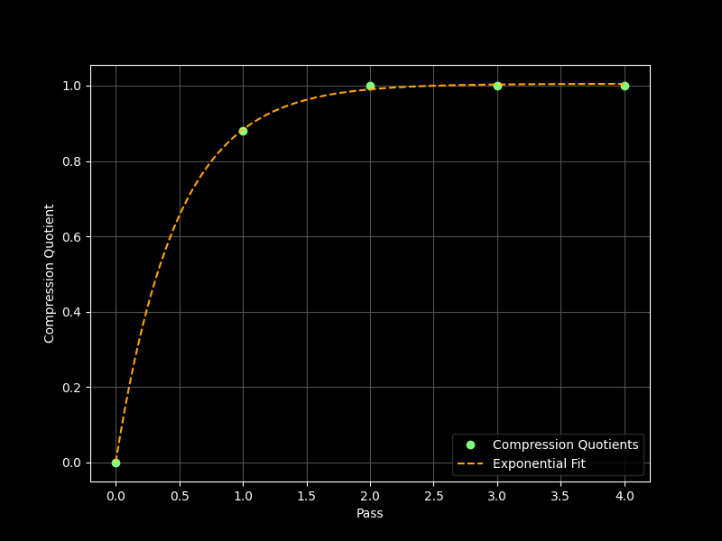

# `dom-inline-style-filter`

  

`dom-inline-style-filter` library filters inline style declarations for a standalone DOM element tree by computed effect.

- As web developers, we would like elements that ship only with inline styling to be light so that they can be included in NPM packages.
- A main use case of this is SVG screenshots of HTML elements.
- Even after a filter algorithm to [filter out user agent styling when inlining the style][css-author-style-filter], there is some way to go with data size.

## Usage

### `dominlinestylefilter(node)`

**Parameter:** `node` - a `HTMLElement` with all style rules embedded as inline style attributes or `<style>` tags.

**Returns:** a `Promise` that resolves to `node`. Within `node`, all inline styling has been filtered to the minimum declarations that produce the same computed style.

### `dominlinestylefilter.sync(node)`

Synchronous version. Returns `node` when the styling compression is completed.

## Optimizations

1.  **When traversing DOM tree of `node`, group nodes by descending node depth.**

    CSS inheritance is computed on the DOM tree via preorder traversal and is additive-cumulative (increases styling data).
	
	For the filter op which is subtractive, we want to traverse the tree in the opposite direction to avoid more recomputation.
    
    The algorithm sorts elements in the `node` tree by descending node depth. (This is known as reverse level order traversal.)

    This gives us a 30% to 40% speed boost. This also ensures declarations are only removed when they really can be inherited.

2.  **When filtering each inline style declaration by computed effect, go for the most hyphenated properties first.**

    In CSS, shorthands consistently have less hyphens than their longhand.

	We want to filter out scenarios where a CSS property matches their shorthand, e.g. `block-size` -> `height` or `border-color` -> `border`.

    The algorithm does a radix sort with bitmasks for standard, custom and vendored proprties, then subsorts by descending hyphen count.

    In tests this filtered another 50% of inline styling. We also get a 20-40% speed boost because we're not setting as many properties back.

## Performance

### `filterAuthorInlineStyles`

The [`filterAuthorInlineStyles` algorithm][css-author-style-filter] was proven to be a single-pass deterministic compression.

Data was collected from manual testing on the output of the `domtoimage.toSvg` function in the `dom-to-image` NPM package.

### Large file inputs

$O(N)$ growth for inputs at large filesizes $|F| >> 1e6 \text{ bytes}$.

| Wikipedia article demo    | Value                                  |
| :------------------------ | :------------------------------------- |
| Number of nodes           | 5558 nodes                             |
| Initial declaration count | 2107482 (377.54 declarations / node)   |
| Pre-compression bytes     | 33.79mb                                |
| Reductions                | 27901890                               |
| Processing time           | 7921.5ms (1.85 ms/node)                |
| Total reduction           | 27.90mb                                |
| Output declaration count  | 263099 (47.13 / node)                  |
| Post-compression bytes    | 5.89mb                                 |
| Compression ratio         | `5.74                                ` |

### `filterWinningInlineStyles`

The `filterWinningInlineStyles` algorithm was proven to be a high-pass multi-pass - $N \approx 4$ - deterministic compression in two modes.

Data was collected from manual testing on the output of the `domtoimage.toSvg` function in the `dom-to-image-more` NPM package.

### Large file inputs

$O(log(N))$ growth for inputs at large filesizes $|F| >> 1e6 \text{ bytes}$.

| Wikipedia article demo    | Value                                  |
| :------------------------ | :------------------------------------- |
| Number of nodes           | 5558 nodes                             |
| Initial declaration count | 186985 (33.65 declarations / node)     |
| Pre-compression bytes     | 3.88mb                                 |
| Reductions                | [2970178, 95584, 16774, 0]             |
| Processing time           | 7921.5ms (1.43 ms/node)                |
| Total reduction           | 3.09mb                                 |
| Output declaration count  | 83512 (15.03 / node)                   |
| Post-compression bytes    | 793.7kb                                |
| Compression quotients     | [0.5379, 0.8891, 0.9800, 1]            |
| Compression ratio         | `4.88                                ` |
| Decay formula             | $1-exp(-33 / 17 \cdot N)$              |

### Graph

### Small file results

$O(c \cdot N), \space c \space \approx \space 4$ growth for inputs at small filesizes $|F| << 1e6\space\text{ bytes}$.

| Code screenshot demo      | Value                                  |
| :------------------------ | :------------------------------------- |
| Number of nodes           | 420 nodes                              |
| Initial declaration count | 17551 (41.79 declarations / node)      |
| Pre-compression bytes     | 429160b                                |
| Reductions                | [298806, 40420, 0]                     |
| Processing time           | 5445.2ms (12.96 ms / node)             |
| Total reduction           | 339226b                                |
| Post-compression bytes    | 89934b                                 |
| Output declaration count  | 7637 (18.18 / node)                    |
| Compression quotients     | [0.696, 0.931, 1]                      |
| Total quotient (compound) | `4.77                                ` |
| Decay formula             | $1-exp(-23 / 11 \cdot N)$              |

<!-- `dom-inline-style-filter` -->
[css-author-style-filter]: https://github.com/1904labs/dom-to-image-more/pull/71
