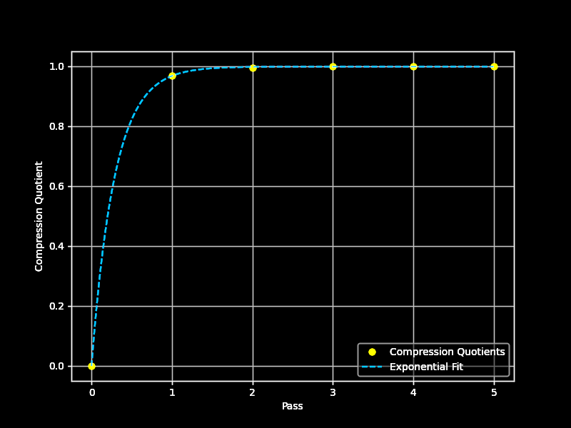

# `dom-inline-style-filter`

  

`dom-inline-style-filter` library filters inline style declarations for a standalone DOM element tree by computed effect.

- As web developers, we would like elements that ship only with inline styling to be light so that they can be included in NPM packages.
- A main use case of this is SVG screenshots of HTML elements.
- Even after a filter algorithm to [filter out user agent styling when inlining the style](https://github.com/1904labs/dom-to-image-more/issues/70), there is some way to go with data size.

## Usage

### `dominlinestylefilter(node)`

**Parameter:** `node` - a `HTMLElement` with all style rules embedded as inline style attributes or `<style>` tags.

**Returns:** a `Promise` that resolves to `node`. Within `node`, all inline styling has been filtered to the minimum declarations that produce the same computed style.

### `dominlinestylefilter.sync(node)`

Synchronous version. Returns `node` when the styling compression is completed.

## Optimizations

1.  **When traversing DOM tree of `node`, group nodes by descending node depth.**

    CSS inheritance is computed on the DOM tree via preorder traversal and is additive-cumulative (increases styling data).
	
	For the filter op which is subtractive, we want to traverse the tree in the opposite direction.
    
    The algorithm sorts elements in the `node` tree by descending node depth. (This is known as reverse level order traversal.)

    This gives us a 30% to 40% speed boost. This also ensures declarations are only removed when they really can be inherited.

2.  **When filtering each inline style declaration by computed effect, go for the most hyphenated properties first.**

    In CSS, shorthands consistently have less hyphens than their longhand.

	We want to filter out scenarios where a CSS property matches their shorthand, e.g. `block-size` -> `height` or `border-color` -> `border`.

    The algorithm does a radix sort with bitmasks for standard, custom and vendored proprties, then subsorts by descending hyphen count.

    In tests this filtered another 50% of inline styling. We also get a 20-40% speed boost because we're not setting as many properties back.

## Performance

The underlying algorithm was determined to be a high-pass multi-pass - $N \approx 4$ - deterministic compression in two modes.

The data was collected from manual testing on the output of the `domtoimage.toSvg` function in the `dom-to-image-more` NPM package.

### Large file inputs

$O(log(N))$ growth for inputs at large filesizes $|F| >> 1e6 \text{ bytes}$.

| Wikipedia article demo    | Value                                  |
| :------------------------ | :------------------------------------- |
| Number of nodes           | 5894 nodes                             |
| Initial declaration count | 128581 (21.8 declarations / node)      |
| Pre-compression bytes     | 3.77mb                                 |
| Reductions                | [2924992, 257746, 87120, 0]            |
| Processing time           | 9642.8ms (1.64 ms/node)                |
| Total reduction           | 3.27mb                                 |
| Output declaration count  | 15853 (2.69 / node)                    |
| Post-compression bytes    | 504.8kb                                |
| Compression quotients     | [0.2252, 0.6967, 0.8525, 1]            |
| Total quotient (compound) | `0.1337                              ` |
| Decay formula             | $1-exp(-33 / 20 \cdot N)$              |

### Graph

### Small file results

$O(c \cdot N), \space c \space \approx \space 4$ growth for inputs at small filesizes $|F| << 1e6\space\text{ bytes}$.

| Code screenshot demo      | Value                                  |
| :------------------------ | :------------------------------------- |
| Number of nodes           | 468 nodes                              |
| Initial declaration count | 11397 (24.4 declarations / node)       |
| Pre-compression bytes     | 373608b                                |
| Reductions                | [292044, 34152, 0]                     |
| Processing time           | 382ms (0.8 ms / node)                  |
| Total reduction           | 326196b                                |
| Post-compression bytes    | 47412b                                 |
| Output declaration count  | 1777 (3.78 / node)                     |
| Compression quotients     | [0.895, 1]                             |
| Total quotient (compound) | `0.1269                              ` |
| Decay formula             | $1-exp(-89 / 40 \cdot N)$              |

